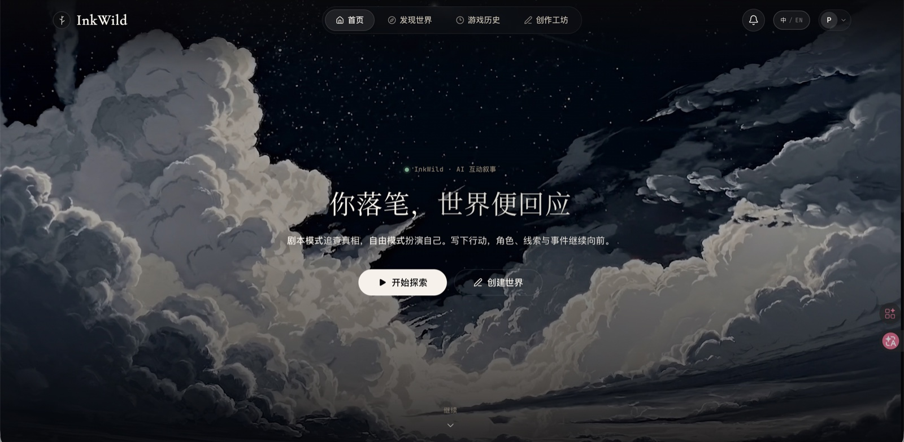
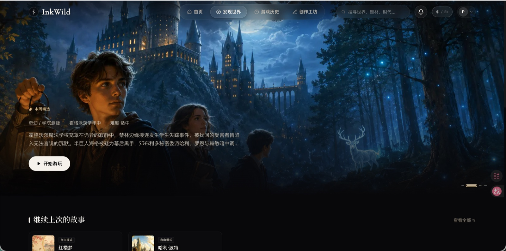
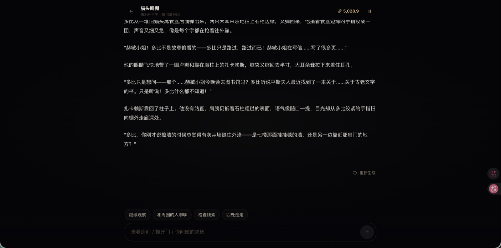
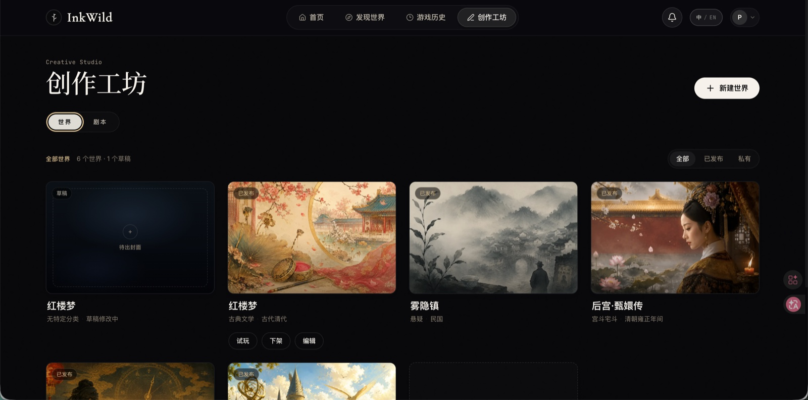
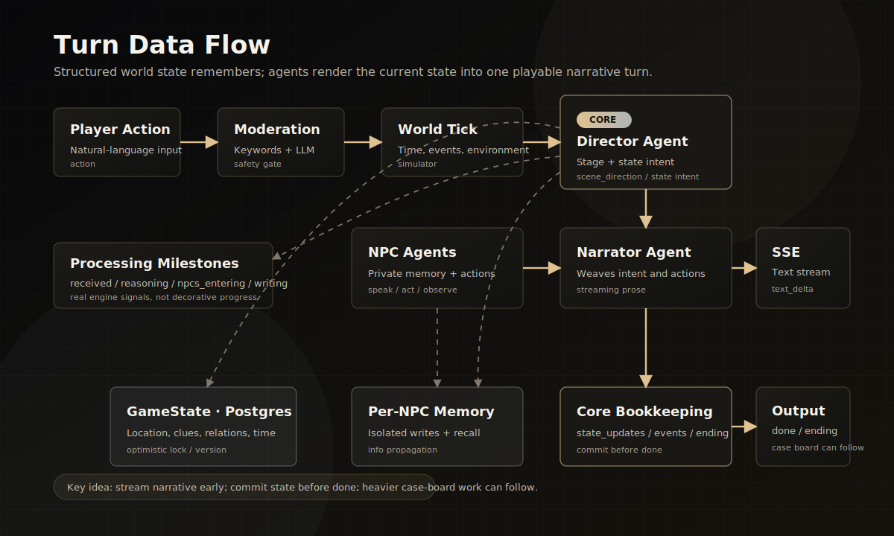

# InkWild

[](LICENSE)
[](https://inkwild.app)
[![LINUX DO](https://img.shields.io/badge/LINUX%20DO-community-FFB003?style=flat&logo=data:image/svg%2bxml;base64,DQo8c3ZnIHhtbG5zPSJodHRwOi8vd3d3LnczLm9yZy8yMDAwL3N2ZyIgd2lkdGg9IjEwMCIgaGVpZ2h0PSIxMDAiPjxwYXRoIGQ9Ik00Ni44Mi0uMDU1aDYuMjVxMjMuOTY5IDIuMDYyIDM4IDIxLjQyNmM1LjI1OCA3LjY3NiA4LjIxNSAxNi4xNTYgOC44NzUgMjUuNDV2Ni4yNXEtMi4wNjQgMjMuOTY4LTIxLjQzIDM4LTExLjUxMiA3Ljg4NS0yNS40NDUgOC44NzRoLTYuMjVxLTIzLjk3LTIuMDY0LTM4LjAwNC0yMS40M1EuOTcxIDY3LjA1Ni0uMDU0IDUzLjE4di02LjQ3M0MxLjM2MiAzMC43ODEgOC41MDMgMTguMTQ4IDIxLjM3IDguODE3IDI5LjA0NyAzLjU2MiAzNy41MjcuNjA0IDQ2LjgyMS0uMDU2IiBzdHlsZT0ic3Ryb2tlOm5vbmU7ZmlsbC1ydWxlOmV2ZW5vZGQ7ZmlsbDojZWNlY2VjO2ZpbGwtb3BhY2l0eToxIi8+PHBhdGggZD0iTTQ3LjI2NiAyLjk1N3EyMi41My0uNjUgMzcuNzc3IDE1LjczOGE0OS43IDQ5LjcgMCAwIDEgNi44NjcgMTAuMTU3cS00MS45NjQuMjIyLTgzLjkzIDAgOS43NS0xOC42MTYgMzAuMDI0LTI0LjM4N2E2MSA2MSAwIDAgMSA5LjI2Mi0xLjUwOCIgc3R5bGU9InN0cm9rZTpub25lO2ZpbGwtcnVsZTpldmVub2RkO2ZpbGw6IzE5MTkxOTtmaWxsLW9wYWNpdHk6MSIvPjxwYXRoIGQ9Ik03Ljk4IDcwLjkyNmMyNy45NzctLjAzNSA1NS45NTQgMCA4My45My4xMTNRODMuNDI2IDg3LjQ3MyA2Ni4xMyA5NC4wODZxLTE4LjgxIDYuNTQ0LTM2LjgzMi0xLjg5OC0xNC4yMDMtNy4wOS0yMS4zMTctMjEuMjYyIiBzdHlsZT0ic3Ryb2tlOm5vbmU7ZmlsbC1ydWxlOmV2ZW5vZGQ7ZmlsbDojZjlhZjAwO2ZpbGwtb3BhY2l0eToxIi8+PC9zdmc+)](https://linux.do)

[简体中文](./README.md) | English

> **An AI interactive narrative engine that keeps the world in the database and lets models render the current turn.**
> Live demo -> **https://inkwild.app**

InkWild is an AI-powered interactive narrative engine. Players act in natural language, and multiple agents collaborate to produce coherent story turns. Its central design is simple: **world state is persisted as structured data; the model does not have to remember the world, it renders the current state into narrative prose.**

Two play modes share the same engine. They differ only in initialization and ending logic:

- **Script mode**: authored mysteries, truth conditions, clues, and endings.
- **Free mode**: open-world play without hard ending conditions; the world keeps moving forward.

The repository also includes an AI creator workshop for generating worlds and scripts, plus an admin console for model routing, users, content, cost, and audit logs.

## Screenshots

<p align="center">
  
</p>

<details>
<summary>More screenshots</summary>

| Discover | Play Turn |
|---|---|
|  |  |
| Creator Workshop | |
|  | |

</details>

## Capabilities

- **Interactive narrative runtime.** Script mode and free mode share one world engine that uses structured state, multiple agents, NPC-private memory, and SSE streaming to maintain long-range consistency.
- **Generation agent.** Creators can start from an original premise, or use a film, novel, game, or other work as reference material to generate world and script drafts. The pipeline includes IP recognition, web research, critic review, draft publishing, and AI-generated visuals. Reference-based generation avoids directly copying official posters, logos, trademarks, or recognizable real faces.
- **Admin console.** Admins manage model providers and slots, generation tasks, users, content, costs, and audit logs.

## Design

The hard part of interactive narrative is not generating one good paragraph. It is **long-range consistency**: after dozens of turns, the world state, character memory, and information boundaries still need to make sense. InkWild handles that with structured state and agent boundaries instead of one ever-growing context window.

- **Externalized world state.** Location, clues, relationships, time, inventory, and the case board live in structured `GameState`, persisted in Postgres. Each turn reads that state, renders it into narrative through agents, and writes state changes back — the prose is a product of the state, not its only home.
- **Multi-agent runtime.** A turn is not one LLM call but a small simulation in which Director, NPC agents, and Narrator split responsibility — closer to an interactive narrative engine than a single chat window.
- **NPC-scoped memory.** Each NPC can only read its own private memories. Information flow between characters is controlled explicitly by `info_propagation`.

## Multi-Agent Runtime

The backend is built around a multi-agent runtime:

- **Director** — decides the stage direction, participating NPCs, state-change intent, event signals, and ending signals for the turn.
- **NPC Agent** — uses isolated memory, relationships, schedule, intent, and voice style to produce structured actions: speak, withhold, observe, act, scheme, or interject.
- **Narrator** — weaves Director intent and NPC actions into streaming narrative prose.
- **World Simulator** — advances time, world events, environment changes, and NPC movement.
- **Memory / Case Board** — preserves long-running context and player discoveries through semantic recall, NPC reflection, and append-only case-board history.
- **LLM Router** — binds text, image, moderation, compression, and workshop tasks to configurable provider slots at runtime.

## Turn Data Flow



The current v2 runtime separates latency from bookkeeping. **Narrative starts streaming as soon as `scene_direction` is ready**, so the player sees text earlier. **Core state is committed before `state_update` / `done`**, so the next turn reads a settled world. In script mode, slower case-board reasoning may arrive as a non-blocking `case_board_update` after `done`.

## Memory And Long Context

- `GameState` is persisted in Postgres with optimistic locking, while Redis `SessionLock` serializes writes per session.
- Long contexts are compressed into structured summaries. Earlier memories are retrieved with embeddings, and Director can explicitly recall earlier fragments by keyword.
- Long-run tests have continued a session past 100 turns without linear latency growth. Director input stays in the tens-of-thousands token range through compression and trimming, with cache hit rates around 50-70%. See [`docs/operations/latency-ttft.md`](docs/operations/latency-ttft.md).

## Repository Layout

```text
backend/          FastAPI backend: narrative engine, LLM routing, services, models, migrations
frontend/         Player-facing Next.js app
admin-frontend/   Separate Next.js admin console
docs/             Architecture, module docs, operations notes, design references
ops/              Operational scripts used by Docker Compose
```

## Tech Stack

| Layer | Technology |
|---|---|
| Backend | Python 3.12 · FastAPI · SQLAlchemy 2 async · Alembic · PostgreSQL 16 · Redis 7 · structlog · SSE |
| Frontend | Next.js 16 · React 19 · TypeScript · Zustand · TanStack Query · Tailwind CSS v4 |
| Admin | Separate Next.js app for model routing, users, content, cost, and audit logs |
| LLM | Text: DeepSeek / Claude / Gemini / Grok / OpenAI-compatible providers via dynamic Provider + Slot binding; image: gpt-image / Grok / Seedream-compatible; search: Tavily |
| Deployment | Docker Compose |

## Local Development

Create local environment files first:

```bash
make setup
```

`make setup` only copies example env files to `backend/.env`, `frontend/.env.local`, and `admin-frontend/.env.local`. It does not overwrite existing files, install dependencies, start services, or generate real secrets.

Put private API keys in `backend/.env`, not in frontend env files. The minimum useful key is:

```dotenv
DEEPSEEK_API_KEY=...
```

Common optional keys:

- `GPTIMAGE_API_KEY` for GPT Image generation; without it, image features are limited or use another configured provider.
- `GROK_API_KEY`, `ANTHROPIC_API_KEY`, Google OAuth, Resend, and OSS keys as needed.

The fastest local path is Docker Compose. It runs the full stack without exposing Postgres or Redis on the host:

```bash
make dev-docker
```

| Service | Default URL |
|---|---|
| Player app | http://localhost:3000 |
| Admin console | http://localhost:3001 |
| Backend API | http://localhost:8000 |

For host-based development, run only Postgres and Redis in Docker:

```bash
make dev-infra

# terminal 1: backend
(cd backend && pip install -e ".[dev]" && alembic upgrade head && uvicorn main:app --reload --port 8000)

# terminal 2: player app
(cd frontend && npm install && npm run dev)

# terminal 3: admin console
(cd admin-frontend && npm install && npm run dev)
```

Port overrides, production Compose, and full environment details are documented in [`docs/operations/quick-deploy.md`](docs/operations/quick-deploy.md) and [`docs/operations/deploy-and-config.md`](docs/operations/deploy-and-config.md).

## Scope

InkWild is currently a one-player, single-line narrative system. It does not support multiplayer sessions, save points, or branching saves. Structured state is designed to reduce long-range inconsistency, memory loss, and information leaks; free-form prose itself is not fact-checked word by word.

## Documentation

There are many project documents. Start from [`docs/README.md`](docs/README.md). Common reading paths:

| Goal | Start with |
|---|---|
| Understand the whole system | [`docs/ARCHITECTURE.md`](docs/ARCHITECTURE.md) |
| Run locally or deploy | [`docs/operations/quick-deploy.md`](docs/operations/quick-deploy.md), [`docs/operations/deploy-and-config.md`](docs/operations/deploy-and-config.md) |
| Change game turns, multi-agent runtime, or SSE | [`docs/modules/README.md`](docs/modules/README.md), [`docs/modules/orchestrator.md`](docs/modules/orchestrator.md), [`docs/modules/sse-protocol.md`](docs/modules/sse-protocol.md) |
| Change generation agent or creator workshop | [`docs/modules/world-creator.md`](docs/modules/world-creator.md), [`docs/design/cover-art-spec.md`](docs/design/cover-art-spec.md) |
| Change frontend visual design | [`frontend/AGENTS.md`](frontend/AGENTS.md) (single frontend reference; tokens live in `frontend/app/globals.css`) |
| Inspect database schema | [`docs/data/schema.md`](docs/data/schema.md) |

## Status / License

InkWild is live at https://inkwild.app and is open source under the [MIT License](LICENSE).
