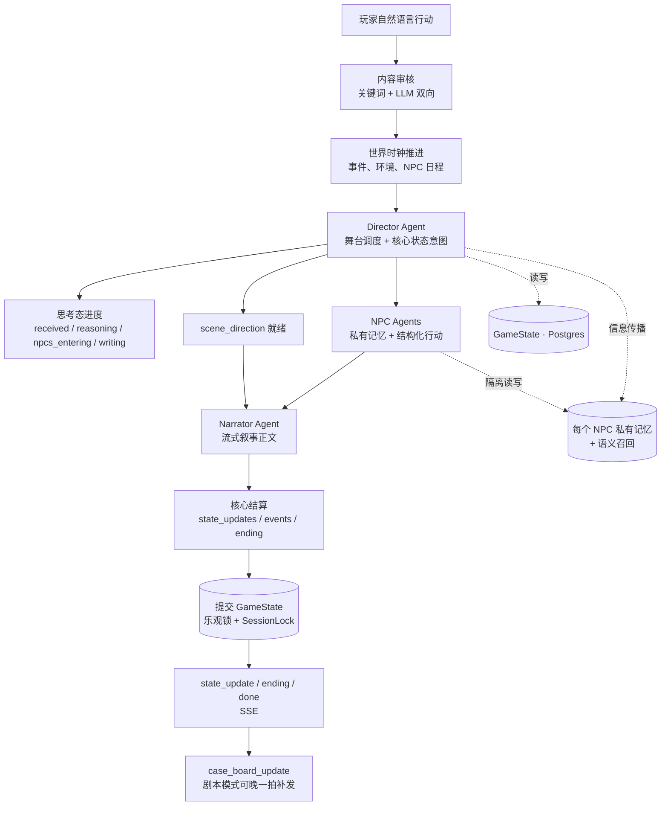

# InkWild

[](LICENSE)
[](https://inkwild.app)

简体中文 | [English](./README.en.md)

> **把世界放进数据库、让大模型只负责渲染的 AI 互动叙事引擎。**
> 在线体验 → **https://inkwild.app**

<!-- 截图位：从线上站截一张 play 页实拍图（或 10s GIF），放 docs/assets/，再把下面这行换成真实图片

-->

InkWild 是一个 AI 驱动的互动叙事引擎。玩家用自然语言行动，多个 Agent 协作演绎出连贯的剧情。它的核心设计是：**世界状态以结构化字段持久化在数据库中，大模型不负责记住世界，只负责把当前状态渲染成这一回合的叙事。**

两种玩法共用同一套引擎，差异只在初始化和结局判定：

- **剧本模式**：预设谜题、真相、结局，玩家在世界里探案。
- **自由模式**：纯开放世界，没有硬性结局条件，世界自己往前推进。

附带一个 AI 创作工坊（生成世界 + 剧本）和一个管理后台（模型路由、用户、内容、成本、审计）。

## 能力概览

- **互动叙事运行时。** 剧本模式和自由模式共享同一套世界引擎，用结构化状态、多 Agent、NPC 私有记忆和 SSE 流式输出维持长程一致性。
- **生成 Agent。** 创作者可以输入原创设定，也可以以影视、小说、游戏等作品作为参考，生成世界 / 剧本草稿；流程包含 IP 识别、联网研究、critic 质检、草稿发布和 AI 配图。参考型生成会避免直接复制官方海报、Logo、商标和可识别真人面孔。
- **管理后台。** Admin 端管理模型 provider / slot、生成任务、用户、内容、成本和审计日志。

## 设计思路

互动叙事最难的不是生成一段好文字，而是**长程一致性**——玩到几十回合之后，世界状态、角色记忆、信息边界能不能保持自洽。InkWild 把这件事交给结构化状态和分工的 Agent，而不是交给一个不断变长的上下文窗口。

- **世界状态外部化。** 位置、线索、人物关系、时间、案件板都是数据库里的结构化字段（`GameState`），不依赖模型在上下文里记住。叙事是从这份状态生成出来的产物，而不是状态本身的唯一载体。
- **多 Agent 分工。** 一个回合不是一次 LLM 调用，而是 Director（舞台调度与状态意图）、NPC（结构化行动）、Narrator（织合叙事）协作完成。
- **记忆按 NPC 隔离。** 每个 NPC 只能读到自己的私有记忆；信息在角色之间的流动由 `info_propagation` 显式控制。

## 多 Agent 运行时

后端围绕一个多 Agent 运行时构建：

- **Director** — 决定这一回合的舞台走向、参与 NPC、状态变化、结局信号，输出结构化导演意图。
- **NPC Agent** — 基于各自隔离的记忆、关系、日程、内驱目标（intent）和语气风格（voice）产出结构化行动：发言、回避、观察、行动、筹划或插话。
- **Narrator** — 把导演意图和 NPC 行动织合成流式叙事散文。
- **World Simulator** — 推进时间、触发世界事件、环境变化、NPC 移动。
- **Memory / Case Board** — 维持长程上下文和玩家的发现：语义召回、NPC 反思、案件板增量历史。
- **LLM Router** — 把文本 / 图像 / 审核 / 压缩 / 工坊任务绑定到可配置的 provider slot，运行时动态切换。

## 一个回合的数据流



当前默认 v2 运行时把两个目标拆开：**叙事正文在 `scene_direction` 就绪后尽早流出**，减少首字等待；**核心状态在 `state_update` / `done` 之前提交**，保证下一回合读取的是已结算世界。剧本模式下耗时较长的案件板推理可以通过 `case_board_update` 在 `done` 后晚一拍补发，不阻塞玩家继续行动。

## 记忆与长上下文

- `GameState` 持久化在 Postgres，用乐观锁（version 列）防并发覆盖，单 session 串行靠 Redis 分布式锁。
- 上下文超过阈值自动做结构化压缩；早期记忆用 embedding 做语义召回，Director 也能主动按关键词调取早期片段。
- 实测同一局连续玩到 100+ 回合，单回合耗时不会随轮数线性增长：Director 输入上下文靠压缩 + 裁剪维持在几十 K token 量级，缓存命中保持在 50–70% 区间。延迟模型与优化记录见 [`docs/operations/latency-ttft.md`](docs/operations/latency-ttft.md)。

## 仓库结构

```
backend/          FastAPI 后端：叙事引擎、LLM 路由、服务、模型、迁移
frontend/         玩家端 Next.js 应用
admin-frontend/   独立的管理后台 Next.js 应用
docs/             架构、模块文档、运维笔记、设计规范
ops/              Docker Compose 用到的运维脚本
```

## 技术栈

| 层 | 技术 |
|---|---|
| 后端 | Python 3.12 · FastAPI · SQLAlchemy 2（async）· Alembic · PostgreSQL 16 · Redis 7 · structlog · SSE |
| 前端 | Next.js 16 · React 19 · TypeScript · Zustand · TanStack Query · Tailwind CSS v4 |
| 后台 | 独立 Next.js 应用（模型路由 / 用户 / 内容 / 成本 / 审计） |
| 大模型 | 文本：DeepSeek / Claude / Gemini / Grok / OpenAI 兼容（经 Provider + Slot 后台动态绑定）；图像：Seedream；联网检索：Tavily |
| 部署 | Docker Compose |

## 本地跑起来

先准备本地配置文件：

```bash
make setup
```

`make setup` 只做三件事：从示例文件生成 `backend/.env`、`frontend/.env.local`、`admin-frontend/.env.local`；如果这些文件已经存在，它不会覆盖。它不安装依赖、不启动服务，也不会生成真实密钥。

所有私密 API Key 都放在 `backend/.env`，不要放进前端 env。最低可用配置：

```dotenv
DEEPSEEK_API_KEY=...
```

常用可选项：

- `TAVILY_API_KEY`：创作工坊联网检索。
- `GPTIMAGE_API_KEY`：gpt-image 生图；不填时图像能力会受限或走其它已配置 provider。
- `GROK_API_KEY` / `ANTHROPIC_API_KEY` / Google OAuth / Resend / OSS 等按需填写。

推荐先用 Docker 一键跑整套，不占用宿主的 Postgres / Redis 端口：

```bash
make dev-docker
```

| 服务 | 默认地址 |
|---|---|
| 玩家端 | http://localhost:3000 |
| 管理后台 | http://localhost:3001 |
| 后端 API | http://localhost:8000 |

如果要本机跑后端和前端、只把数据库和 Redis 放 Docker：

```bash
make dev-infra

# 终端 1：后端
(cd backend && pip install -e ".[dev]" && alembic upgrade head && uvicorn main:app --reload --port 8000)

# 终端 2：玩家端
(cd frontend && npm install && npm run dev)

# 终端 3：管理后台
(cd admin-frontend && npm install && npm run dev)
```

端口覆盖、生产 Compose、完整环境变量说明见 [`docs/operations/quick-deploy.md`](docs/operations/quick-deploy.md) 和 [`docs/operations/deploy-and-config.md`](docs/operations/deploy-and-config.md)。

## 范围与边界

目前是一对一单线叙事：没有多人同局，也没有存档点 / 分支。结构化状态主要解决长程一致性（失忆、前后矛盾、信息越界），自由叙事的散文本身不做逐字的事实校验。

## 文档

文档较多，先从 [`docs/README.md`](docs/README.md) 进入。常用阅读路径：

| 你想做什么 | 先看 |
|---|---|
| 理解系统整体 | [`docs/ARCHITECTURE.md`](docs/ARCHITECTURE.md) |
| 本地启动 / 生产部署 | [`docs/operations/quick-deploy.md`](docs/operations/quick-deploy.md), [`docs/operations/deploy-and-config.md`](docs/operations/deploy-and-config.md) |
| 改游戏回合 / 多 Agent / SSE | [`docs/modules/README.md`](docs/modules/README.md), [`docs/modules/orchestrator.md`](docs/modules/orchestrator.md), [`docs/modules/sse-protocol.md`](docs/modules/sse-protocol.md) |
| 改生成 Agent / 创作工坊 | [`docs/modules/world-creator.md`](docs/modules/world-creator.md), [`docs/design/cover-art-spec.md`](docs/design/cover-art-spec.md) |
| 改前端视觉 | [`docs/design/visual-principles.md`](docs/design/visual-principles.md), [`docs/design/frontend-spec.md`](docs/design/frontend-spec.md), [`frontend/AGENTS.md`](frontend/AGENTS.md) |
| 查数据库结构 | [`docs/data/schema.md`](docs/data/schema.md) |

## 状态 / 许可证

InkWild 已正式上线运行（主站 https://inkwild.app），基于 [MIT 许可证](LICENSE) 开源。
