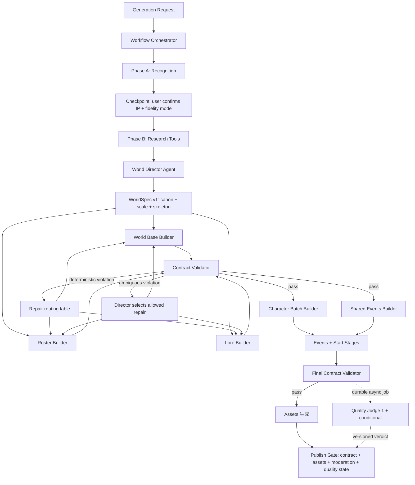

# 世界生成 Agentic Workflow 重构设计

> 状态：本地实现完成 / 待本地验收后另行批准生产（2026-07-16；实现清单见 §19）
> 日期：2026-07-16
> 范围：创作工坊世界生成；本设计不包含剧本生成重构，也不包含模型选型调整
> 目标：降低无意义模型调用和长尾延迟，同时保留大型世界厚度、IP 忠实度及历史修复形成的安全边界
> 相关文档：
> - [世界生成厚度与 must-have 闭环](2026-06-22-world-gen-thickness-and-must-have.md)
> - [生成 Agentic Loop](2026-06-24-generation-agentic-loop.md)
> - [自由模式人生阶段](2026-06-24-free-start-stages.md)
> - [生成质量 Loop 重启](2026-06-25-generation-quality-loop-reopen.md)
> - [WorldSpec 生成架构](2026-06-25-worldspec-generation-rebirth.md)

---

## 0. 决策摘要

本次应按一次**生成架构重构**处理，而不是继续给现有流水线增加或删除零散调用。

推荐形态：

> **确定性 Workflow 外壳 + 单个受约束的 World Director Agent + 标准生成工具 + 外部 Validator。**

Director 的实际定位更接近 **plan-then-execute 的规划节点**，而不是持续运转的自由 Agent：正常成功路径上只有 1–2 个模型决策点（研究综合 compile，必要时加研究前规划），异常路径最多再加歧义仲裁 / replan。violation 到修复动作能查表确定的一律由代码直接路由（见 §6.4），不唤醒模型。

同时必须诚实归因：调用数收敛的主要收益来自纯 Workflow 改造——研究去重、free-start 批量化、judge 1 + conditional——这些先于 Director Agent 落地（阶段顺序见 §14）。Agent 带来的是可解释性和异常路径的鲁棒性，不承担省调用的 KPI。

不推荐两种极端：

1. 继续使用所有世界走相同步骤的纯固定 Workflow：稳定但僵硬，容易通过补丁不断堆调用。
2. 改成完全自由的 Agent：路径、调用次数、停止条件和结果难以预测，可能比现在更慢。

这里的“受约束”指：

- Agent 可以决定**还缺哪轴研究、canon 如何裁决、歧义 violation 修哪个节点、是否需要 replan**。
- 代码负责决定**哪些事实不能修改、哪些校验不能绕过、最多花多少预算、什么条件才能发布、无歧义 violation 的默认修复路由**。

世界生成不是 Multi-Agent 社会模拟。第一版只引入一个 Director Agent，不把 Research、Character、Lore、Event 各自包装成互相对话的 Agent。

---

## 1. 为什么现在需要重构

### 1.1 当前实现本质上是 Workflow，不是 Agent

虽然核心文件名是 `world_creator_agent_v2.py`，但当前生成方式具备以下特征：

- 阶段顺序由 Python 预先写死。
- 阶段依赖和并发关系由代码决定。
- 各阶段输入输出基本固定。
- 模型不能动态选择下一步、跳过步骤或终止流程。
- 重试主要由阶段内部和外层 wrapper 共同控制。
- critic/quality scorer 只评分或兜底，不真正拥有流程控制权。

因此准确名称应是 `WorldGenerationWorkflow`，不是完整意义上的 Agent。

### 1.2 当前调用数量不是单一模型问题

2026-07-16 对生产最近一次《长安十二时辰》生成做只读审计：

- 数据库已记录 31 次 Grok 4.5 文本调用。
- 结合未计量的识别、研究摘要、直接 Grok Search 等调用，取消前实际已完成约 38 次文本调用。
- 若继续完成视觉简报和固定 3 次质量投票，预计整次约 43 次文本调用。
- 其中 IP 研究阶段约占 14 次调用和 12 分钟以上墙钟时间。
- 这些调用均成功，问题不是失败重试，而是流程本身重复加工同一份内容。

当前重复主要来自：

1. 通用 research 与 IP research 内容重叠。
2. 四轴检索后，每轴还做预抽取、ground、合并、裁决和补抓。
3. 同一阶段既有内部重试，又可能被外层整体重试。
4. free-start 从单主角扩展成多个角色后逐角色串行调用。
5. 质量评分固定运行 3 个同类 judge。
6. 历史问题通过局部节点修复，保护目的正确，但调用拓扑逐渐膨胀。

### 1.3 不能以减少调用为理由压薄大型世界

生产样本快照：

| 世界 | IP 研究角色 | 最终角色 | 当前可玩/出图目标 |
|---|---:|---:|---:|
| 甄嬛传 | — | 30 | 15 |
| 凡人修仙传 | 44 | 30 | 15 |
| 长安十二时辰（取消前中间产物） | 34 | 29 | 12 |

历史上“甄嬛传只出 6 个角色，并丢失皇帝、华妃、皇后”已经证明：大型 IP 不能使用统一的低人数上限。

重构目标是去掉**重复理解和重复裁决**，不是去掉大型世界真实需要的角色批次。

---

## 2. 目标与非目标

### 2.1 目标

1. 小型、标准、大型世界使用不同生成计划和预算。
2. 每次模型调用都有明确原因、输入、输出、所属节点和预算归属。
3. 研究结果只综合一次，形成统一 `WorldSpec`。
4. 下游 Builder 只能扩写，不得重新解释或改变已冻结事实。
5. 失败只修复对应节点，不轻易重跑整条链路。
6. 流程正确性与内容质量分开校验。
7. 保留所有有明确历史原因的保护规则。
8. 生成过程可暂停、恢复、回放和解释。
9. 正常大型 IP 的文本调用预算从目前约 40 次收敛到约 18–24 次；最终预算以本地基准测试校准。

### 2.2 非目标

1. 本期不引入多个 Agent 互相讨论。
2. 本期不让 Agent 直接操作数据库、发布状态或生产配置。
3. 本期不修改游玩引擎的 Director/NPC/Narrator Agent。
4. 本期不决定 Grok 4.5 的替代模型。
5. 本期不以固定人数压缩所有世界。
6. 本期不构建无限 evaluator-optimizer loop。
7. 本期不同时重构剧本生成；世界稳定后再复用架构。

---

## 3. 术语与职责边界

### 3.1 Workflow Orchestrator

纯代码组件，不判断内容质量，负责：

- DAG 和节点依赖。
- 并发调度。
- 节点输入输出持久化。
- 超时、取消和断点恢复。
- 调用预算和停止条件。
- 重试、修复次数和幂等性。
- usage、耗时和错误记录。
- 发布前硬门禁。

### 3.2 World Director Agent

唯一拥有有限流程决策权的模型节点，负责：

- 判断世界规模和复杂度。
- 判断研究是否充分、缺哪个方向。
- 从证据中选择 canon、版本和时代。
- 制定阵容、可玩视角和世界骨架。
- 生成或更新 `WorldSpec` 的未冻结部分。
- 在修复路由存在歧义时选择允许的局部修复动作（无歧义 violation 由代码路由表直接处理，见 §6.4）。
- 在异常或修复后判断当前计划是否需要 replan；最终完成状态由 Orchestrator 计算。

Director 不直接生成所有大段内容，也不直接发布。

### 3.3 Builder Tool

完成单一、结构化生成任务，例如：

- `search_ip_axis`
- `build_world_base`
- `build_character_roster`
- `build_character_batch`
- `build_lore_pack`
- `build_shared_events`
- `build_events_data`
- `build_free_start_stages`
- `build_visual_brief`

Builder 不拥有流程控制权，也不能修改不属于自己的冻结层。

### 3.4 Contract Validator

尽量使用纯代码和确定性规则校验结构、引用和契约。Validator 的失败可以阻止进入下一节点或发布。

### 3.5 Quality Judge

独立于生成上下文的语义审核模型。Judge 给出内容质量和红旗，不承担结构修复，也不能自行发布。

---

## 4. 总体架构



核心原则：

> Agent 决定有歧义的路径；Workflow 执行动作并决定完成状态；WorldSpec 保存事实；Validator 决定是否合规；Judge 异步、持久化地产出版本化红旗；Publish Gate 最终拍板。

当前产品在 IP 识别后有一次真实的用户交互边界：Phase A 只产出识别结果，用户确认 IP 和 fidelity mode 后才创建 Phase B 任务。新架构必须保留这个 checkpoint，不能把 Recognition 到 Research 当成一个不可暂停的后台调用链。

---

## 5. WorldSpec：唯一事实源

### 5.1 为什么需要 WorldSpec

当前各阶段经常拿上游的自然语言结果重新理解世界，导致：

- 研究层的多个 IP 版本同时进入世界。
- roster 删除或漏掉核心角色。
- 角色详情阶段改名后身份丢失。
- 角色日程引用不存在的地点。
- shared events、lore、角色详情对时代和关系各说各话。
- 最终 critic 只能看到结果，无法知道哪个阶段违反了原始决策。

WorldSpec 把“建议”升级为“契约”。

### 5.2 建议结构

```jsonc
{
  "identity": {
    "kind": "known_ip",
    "ip_name": "甄嬛传",
    "ip_type": "tv",
    "canon_version": "电视剧版",
    "era": "清·雍正年间",
    "fidelity_mode": "strict"
  },
  "scale": {
    "class": "epic",
    "cast_target_min": 24,
    "cast_target_max": 30,
    "playable_target_min": 8,
    "playable_target_max": 15,
    "portrait_budget": 8,
    "text_call_budget": 24
  },
  "canon": {
    "must_have_characters": [],
    "optional_characters": [],
    "excluded_characters": [],
    "factions": [],
    "timeline": [],
    "arbitration_note": ""
  },
  "world_skeleton": {
    "locations": [],
    "location_aliases": {},
    "character_slots": [],
    "relationship_edges": [],
    "shared_event_skeleton": [],
    "playable_archetypes": [],
    "protagonist_names": []
  },
  "locks": {
    "identity": true,
    "canon": true,
    "scale": true,
    "locations": false,
    "roster": false,
    "events": false
  },
  "execution": {
    "generation_run_id": "stable-across-phase-a-b-and-repairs",
    "root_task_id": "phase-a-task-id",
    "active_task_id": "current-attempt-task-id",
    "draft_id": "world-draft-id",
    "payload_revision": 1,
    "payload_hash": "sha256:...",
    "completed_nodes": [],
    "repair_attempts": {},
    "remaining_call_budget": 0,
    "violations": [],
    "quality_status": "pending"
  }
}
```

### 5.3 分层冻结

| 时点 | 冻结内容 | 后续允许行为 |
|---|---|---|
| Director 首次裁决后 | identity、canon、scale | 只能显式发起 replan，不能由 Builder 偷改 |
| world base 完成并通过校验后 | locations、location aliases | 角色只能引用或申请 union-back |
| roster 完成并通过校验后 | 角色身份、角色槽位、playable 标记 | 详情阶段只能扩写字段 |
| shared event skeleton 完成后 | 关键时代、因果节点 | events 只能具体化，不能改主线版本 |
| final contract 通过后 | 全部结构层 | 只允许质量建议和资源生成 |

冻结不是永远不可变。需要修改时必须产生显式 `replan` 记录，说明原因、影响层和预算，不允许静默覆盖。

---

## 6. “受约束 Agent”的动作模型

### 6.1 Agent 可以选择的动作

```text
SEARCH_AXIS(axis)
COMPILE_SPEC
EXPAND_RESEARCH(axis, reason)
BUILD_NODE(node, parameters)
REPAIR_NODE(node, violation_ids)
REPLAN_UNLOCKED_LAYER(layer, reason)
```

Director 每次只能返回结构化动作：

```json
{
  "action": "REPAIR_NODE",
  "target": "character_batch",
  "reason": "两个 roster 槽位缺少详情",
  "violation_ids": ["character_missing:皇后", "character_missing:华妃"],
  "expected_result": "只补齐两个缺失角色",
  "estimated_calls": 1
}
```

### 6.2 Agent 不允许做的事

- 直接执行 SQL 或写生产数据库。
- 跳过 Contract Validator。
- 修改已经冻结的 canon、角色身份或时代。
- 把 `must_have` 角色静默降级或删除。
- 把“可玩角色”和“需要首批出图角色”继续混为一个字段。
- 自行增加未注册工具。
- 超过剩余预算仍继续调用。
- 对同一 violation 无限重试。
- 在真实图片不存在时宣布 assets 完成。
- 只根据自己的质量分宣布可发布。

### 6.3 为什么不使用自由 ReAct Loop

自由的 `observe → think → act → observe` 会为每个工具调用增加额外决策轮，并容易产生重复搜索和自我审核。

本设计采用**事件驱动的有限决策点**：

1. 研究开始前（compact / 原创世界可由规则直接定计划，不唤醒）。
2. 研究结果汇总后（compile，必经）。
3. Contract Validator 失败且修复路由存在歧义时（无歧义走 §6.4 查表，不唤醒）。
4. Quality Judge 出现红旗且用户/admin 选择定向修复时（异步旁路，见 §10.2；仅在需要跨层 replan 时唤醒）。

正常成功路径上实际唤醒 Director 的只有第 2 点（必要时加第 1 点），即 1–2 次决策调用；其余决策点只在异常时触发。没有新信息或 violation 时，Workflow 按计划继续，不需要 Agent 每完成一个小工具就重新思考一次。

最终完成或降级不是 Agent 动作。Orchestrator 根据 required nodes、Contract Validator、asset 状态、moderation 和 quality 状态机确定 `content_ready`、`publishable`、`needs_review` 或 `failed`；Director 无权返回 `STOP_READY` 绕过这些条件。

### 6.4 修复路由：查表优先，Agent 兜底

绝大多数 violation 到修复动作的映射是一对一确定的，这类修复由 Orchestrator 按路由表直接执行，不唤醒 Director：

| violation code | 默认修复动作（代码直接执行） |
|---|---|
| character_missing | BUILD_NODE(character_batch, missing_only) |
| location_ref_invalid | Validator 引用改写 / alias union-back |
| bad_json / schema_invalid | 同节点一次格式修复重试 |
| asset_missing | 重跑对应图片节点，或按策略降级 text-only |

只有以下情形才唤醒 Director 做 REPAIR / REPLAN 决策：

- 多个 violation 指向不同层、修复动作互相冲突，或涉及冻结层。
- 需要 EXPAND_RESEARCH 或 REPLAN_UNLOCKED_LAYER。
- 同一 violation 按路由表修复 1 次后仍未消除。

这样既进一步减少决策调用，也消掉“Agent 选错修复动作”这一整类失败面。

---

## 7. 动态角色规模

### 7.1 必须拆开四个概念

1. **Research Roster**：研究阶段收集到的候选人物，允许较宽，不能等同最终世界角色。
2. **Active Cast**：最终进入世界、有完整角色档案的角色。
3. **Playable Cast**：具备独立玩家视角和可玩价值的角色。
4. **Portrait Targets**：首批需要生成头像的角色，属于资源预算。

当前 `is_image_target` 同时承担 Playable 和 Portrait 两个概念，必须拆成独立字段，例如：

```text
playable_role: bool
portrait_target: bool
```

### 7.2 默认规模区间

| 规模 | 典型场景 | Active Cast | Playable Cast |
|---|---|---:|---:|
| compact | 单地点、短事件、封闭推理 | 8–12 | 3–5 |
| standard | 多地点、中等主线、常规原创世界 | 12–20 | 4–8 |
| epic | 长篇 IP、群像、多势力、多时代/剧情弧 | 20–30 | 8–15 |

这些是默认区间，不是统一硬上限。

### 7.3 规模决策信号

优先级从高到低：

1. 用户明确要求的规模或角色数。
2. `must_have` 数量。
3. 主要势力数量及每个势力所需的功能角色。
4. 时代/成长阶段/剧情弧数量。
5. 是否为群像、多主角或多路线作品。
6. IP 类型只作为先验，不直接决定人数。

约束规则：

- 所有 in-continuity 的 `must_have` 必须进入 Active Cast。
- 每个主要势力至少有可识别的代表和关系承载者。
- Active Cast 默认上限不足以容纳 must-have 与必要支撑角色时，自动扩大，不得裁掉事实角色。
- Playable 依据“是否提供独立且成立的玩家视角”选择，不按固定百分比切割。
- 大型 IP 可达到 8–15 个可玩角色；3–6 只适合 compact/部分 standard 世界。
- Portrait Targets 单独受图片预算控制，不能反向压缩 Playable Cast。

### 7.4 规模校验

Validator 不应只检查“角色数是否达到 12”，而应检查：

```text
must_have_coverage == 100%
active_cast within planned range OR has explicit expansion reason
each required faction/arc has assigned character slots
playable roles satisfy planned archetype coverage
portrait targets do not redefine playable roles
```

---

## 8. 研究流程重构

### 8.1 保留四类覆盖意图，合并为两条查询

四轴检索来自明确的历史问题：单次检索只拿到最知名角色，外围 NPC、对立阵营和世界设定不足。

保留四个覆盖面，但按真实同模型验证合并成两条互补查询：

1. 核心人物。
2. 对立人物/势力。
3. 支撑人物/外围 NPC。
4. 世界设定、地点、势力和事件。

### 8.2 去掉重复加工

目标流程：

```text
Recognition（1）
  ↓
2-query search（核心+对立、外围+世界，并发）
  ↓
Director compile（1–2，拆分见 §8.3）
  ├─ compile_arbitration：canon arbitration + source grounding + WorldScalePlan + must-have
  └─ compile_skeleton：WorldSpec skeleton + 地点语义别名 + protagonist_names
```

不再默认执行：

- 每个轴分别用主模型预抽取完整 pack。
- 合并后再次整包 ground。
- 完整 pack 多轮 refetch + reground。
- 通用 research summary 与 IP research summary 重复生成。
- canon、规模、阵容在多个阶段分别重新判断。

如果 Director 发现某一轴资料不足，只允许针对该轴补查一次，并说明缺口，不得整包重新搜索。

### 8.3 compile 的已知风险与验证要求

compile 把 canon 裁决、规模、must-have、骨架、别名收进一到两次调用，输入是两条互补查询的原始材料，仍需防范历史上“roster 开 reasoning 后输出为空”的高危形态（§12）。约束如下：

- 预算按 **2 次调用**设计（arbitration / skeleton 分开），实测单次能稳定产出完整 JSON 后再合并为 1 次，方向是先稳后省。
- 当前多轮 pre-extract 的历史动因是单次抽取漏外围角色。因此“综合后能否保住大型阵容（甄嬛传 30 人、凡人修仙传 44 候选）”是调用收敛阶段的**第一个回归验证点**；不通过则保留分轴轻量抽取，而不是硬砍。

---

## 9. Builder 设计与局部修复

每个 Builder 必须声明：

```text
input_schema
output_schema
reads_worldspec_layers
writes_worldspec_layer
invariants
timeout
max_attempts
estimated_calls
fallback_policy
```

### 9.1 角色详情

大型世界 30 人、每批 6 人，需要 5 个角色详情调用，这是合理调用，不应为了减少次数塞进一个超大 JSON。

必须保留：

- 按 roster 槽位绑定身份，而不是按 LLM 返回名称精确匹配。
- roster 的 `role_tag`、playable 等结构字段优先于 detail 输出。
- 批次失败隔离。
- 缺失角色只补缺失名单，不重跑全部角色。
- transient error 上抛给统一重试层，不能被 Builder 吞掉。

### 9.2 地点

必须保留：

- 权威地点集合。
- 居所主人锚定。
- 确定性名称归一化。
- 语义别名映射（如“严府”与“严嵩府邸”）。
- 角色引用新地点时的 union-back 对账。

语义别名优先由 Director 的 WorldSpec 综合阶段生成，避免再单独调用一个别名裁判；Validator 负责引用改写和一致性。

### 9.3 Free Start Stages

历史上从单主角扩为多角色，是为了解决群像世界把阶段挂到错误 `playable[0]` 的问题，不能简单退回按第一可玩角色处理。

新方案：

- Director 在 WorldSpec 显式声明 `protagonist_names`。
- 单主角作品只生成一套。
- 真群像或多主角作品允许多套。
- 所有选中主角的阶段尽量在一次结构化批量调用中生成，不再逐角色串行调用。
- 单次最多处理 3 个主视角，结果必须按请求的 `character_name` 槽位绑定，不能依赖返回顺序或模型自行改名。
- 对批量结果逐角色解析和校验；一个角色坏 JSON/缺失不能让整批失效，只对缺失主视角执行一次 missing-only retry。
- 先行止血 PR 尚未依赖 WorldSpec：保留一次轻量主视角选择，再做一次批量生成。Phase 2 有 `protagonist_names` 后删除前一调用。

---

## 10. 质检架构

### 10.1 第一层：流程/契约校验

主要由代码完成，确定性、同步、可阻止下一阶段或发布：

- Schema 和必填字段。
- WorldSpec 冻结层未被篡改。
- must-have 真实覆盖。
- roster 与角色详情一一对应。
- 角色、地点、事件和关系引用有效。
- 角色数和可玩数符合本次 WorldScalePlan。
- shared events 和 events_data 的时代/角色引用一致。
- 图片、封面和上传结果真实可用。
- task success 不得代替 asset success。

Contract Validator 的输出必须是机器可消费的 violation：

```json
{
  "code": "character_missing",
  "severity": "blocking",
  "node": "character_batch",
  "entity_ids": ["皇后", "华妃"],
  "repairable": true
}
```

### 10.2 第二层：内容质量校验

由独立 Judge 判断语义质量：

- IP、版本、时代一致性。
- 角色区分度和功能撞车。
- 关系、事件和世界规则的因果一致性。
- 可玩视角覆盖。
- 世界厚度与内容密度。
- 原创性、文案质量和 AI 味。

Judge 保持**异步旁路**，不进入生成关键路径，但不能继续使用不可恢复的进程内 fire-and-forget：Final Contract 通过并落 draft 时，要原子创建一个持久化 quality job；worker 异步消费，失败可恢复，不增加生成主链路墙钟。

quality job 状态至少包括：

```text
pending → running → passed
                  ↘ needs_review
                  ↘ failed
                  ↘ waived（显式人工操作，必须审计）
```

每次 verdict 必须绑定 `draft_id + payload_revision + payload_hash`。用户编辑 draft 后，旧 verdict 自动变成 `stale`，Publish Gate 不得继续消费旧分；系统应为新 revision 重新排队，或由有权限的人显式 waiver。

发布策略分期处理：

- Contract、assets、moderation 属于确定性硬门禁，始终 fail-closed。
- Judge 尚未完成、失败或 verdict stale 时，不允许直接公开发布；可保存/试玩私有 draft，public publish 等待重试或显式 waiver。
- 在人工基准集完成校准前，普通 overall 低分只进入 `needs_review`，不直接永久拒绝发布。
- 对 IP/时代严重矛盾等灾难性红旗，至少经过第 2 个 Judge 确认，或由 admin 人工确认后阻断/放行。
- 校准稳定后，再把经过验证的特定 blocking flag 提升为自动硬门禁；不以一个综合分数作为唯一发布条件。

建议调用策略：

1. 正常世界运行 1 个 Judge。
2. Judge 给出 blocking、低置信度或临界结果时，运行第 2 个 Judge。
3. 两者结论冲突且会影响发布/修复时，才运行第 3 个 tie-breaker。

是否追加第 2/3 个 Judge 由确定性质量策略根据 flag、置信度和分数区间决定，不需要唤醒 Director。

固定调用 3 次相同模型只能降低随机噪声，不能自动把自定义 Rubric 变成标准。

### 10.3 评分标准如何建立

需要建立一次性的人工基准集，而不是继续调整一个未经校准的 overall 公式：

- compact / standard / epic。
- known IP / original。
- strict / loose。
- 合格、边缘、灾难性错误样本。
- 至少包含甄嬛传、凡人修仙传、长安十二时辰、跨时代污染、角色同质化、地点漂移等回归样本。

人工确认的基准用于校准 Judge 和阈值；线上只做抽样人工复核，不需要每个世界人工评分。

### 10.4 Moderation

内容安全是独立的硬门禁，既不属于“内容好不好”，也不能由质量分抵消。保留现有 moderation，放在生成输入和发布输出两侧。

---

## 11. 调用预算、重试和停止

### 11.1 初始预算建议

以下仅作为本地 benchmark 起点，最终值依据真实调用分布调整：

| 类型 | 文本调用预期 | 备注 |
|---|---:|---|
| compact | 10–16 | 角色批次少，可跳过重研究 |
| standard | 14–20 | 常规研究、2–4 个角色批次 |
| epic known IP | 18–24 | 两条互补研究查询、约 5 个角色批次 |

图片调用单独计量，不与文本调用混为一个预算。

### 11.2 大型 IP 典型预算拆分

| 节点 | 预期调用 |
|---|---:|
| Recognition | 1 |
| 两条互补研究查询 | 2 |
| Director compile（scale / lore skeleton / viewpoint） | 1 |
| World base + roster + lore content | 3 |
| 30 人角色详情 | 5 |
| shared events + events data | 2–3 |
| free-start 批量生成 | 1 |
| visual brief | 1 |
| quality judge | 1，异常时 +1 |

### 11.3 重试原则

- 网络、429、5xx、连接中断：由统一基础设施层进行有限重试。
- 坏 JSON：节点允许一次格式修复或同节点重试。
- 内容缺失：进入 Validator violation，由 Director 选择定向修复。
- 禁止 Builder 内部重试三次、Workflow 外层再整体重试三次。
- 对相同 violation 最多修复 1–2 次。
- 两次没有改善时停止为 `needs_review`，不无限循环。

### 11.4 完成与发布状态机

停止权属于 Orchestrator，不属于 Director。建议状态机：

```text
generating
  → content_ready + quality_pending
  → publishable
  → published

quality_pending
  → needs_review
  → quality_failed
  → waived（人工审计后）
```

`content_ready` 条件：

```text
required nodes completed
blocking contract violations == 0
must_have genuine coverage == 100%
remaining references valid
asset gate passed or generation is intentionally text-only
```

`publishable` 在 `content_ready` 基础上还要求：

```text
quality verdict matches current payload_revision/hash
quality status == passed OR explicitly waived by authorized policy
moderation passed
```

这样生成主链路可以及时向用户交付可编辑 draft，同时 public publish 不会绕过尚未完成或已经过期的质量结论。

---

## 12. 历史问题回归保护矩阵

本次重构的原则是：**可以改变调用拓扑，但不能丢掉修复形成的 invariant。**

| 历史问题 | 根因 | 必须保留的 invariant | 新架构归属 |
|---|---|---|---|
| 甄嬛传只出 6 人、漏皇帝/华妃/皇后 | 研究薄、roster 约束冲突、must-have 无闭环 | 四类覆盖意图、动态规模、must-have 100% | Research + WorldSpec + Validator |
| roster 开 reasoning 后输出为空 | reasoning 吃完 token，JSON 被截断 | 规划与大 JSON 生成策略分离；坏输出有限降级 | Builder policy |
| 角色详情改名后一次丢 12 人 | 使用返回名字精确匹配 roster | 按请求槽位绑定身份，结构字段继承 roster | Character Builder |
| must-have 在详情批次丢失 | 批次缺项只 warning | 缺失名单定向补齐，记录 genuine coverage | Validator + Repair |
| 新 IP 被识别成原创 | 离线模型知识滞后 | 联网/快速识别和置信度兜底 | Recognition |
| world_base 坏 JSON 后 0 地点 | JSON 解析在 retry 外，失败后静默空结果 | 解析失败可重试；IP 地点兜底；0 地点阻断 | World Base + Validator |
| 跨时代角色进入世界 | 研究只并集、不裁决 continuity | canon arbitration、`in_continuity` | Director + WorldSpec |
| 多版本世界观糅合 | 下游各自重新理解研究材料 | 单一 canon 版本和冻结 skeleton | Director + WorldSpec |
| 皇后寝宫没有皇后 | 角色批次只看到地点名，没看到居所语义 | 居所主人锚定和地点描述契约 | WorldSpec + Character Builder |
| 严府/严嵩府邸等地点重复 | 只有字符串去重 | alias map + 引用改写 + union-back | Director + Validator |
| 群像世界阶段挂错角色 | 默认选择 playable[0] | 显式 protagonist_names，支持真多主角 | WorldSpec + Free Start Builder |
| overall 高分但 IP 内容错误 | 硬指标只奖励数量，soft 不进判定 | Contract 与 Quality 分离；红旗独立 | Validator + Judge |
| task succeeded 但图片占位/404 | images warning 不阻断任务成功 | Asset Gate 校验真实文件/URL | Publish Gate |
| 某批失败拖垮全部角色 | 批次错误边界不清 | 批次隔离和 missing-only repair | Character Builder |

所有矩阵项都应转成自动化回归测试；没有测试覆盖前，不删除对应旧保护代码。

---

## 13. 状态持久化与可观测性

### 13.1 每个 NodeRun 应记录

```text
generation_run_id
root_task_id
task_id
parent_task_id
phase
draft_id
payload_revision / payload_hash
node_id
attempt
reason
input_worldspec_version
output_worldspec_version
model_slot / model_id
started_at / finished_at
input_tokens / output_tokens
estimated_cost / actual_cost
status
violations_produced
repair_parent_node_run_id
```

### 13.2 跨 Phase 的 GenerationRun

一次用户感知的世界生成会跨越多个 `generation_task`：Phase A 只做 IP recognition，用户确认后 Phase B 才生成世界；取消、恢复和定向修复还可能继续创建 task。因此状态层级必须区分：

| 标识 | 含义 |
|---|---|
| `generation_run_id` | 一次完整世界生成，从 Phase A 到发布前质量结论保持稳定 |
| `task_id` | 某个 phase/attempt 的执行任务，可取消、失败或重建 |
| `draft_id` | 用户正在编辑的内容实体 |
| `payload_revision/hash` | 当前被校验、评分和准备发布的具体内容版本 |
| `node_run_id` | 单个节点的一次执行 |

调用预算、WorldSpec 版本和完整调用树按 `generation_run_id` 汇总；超时和取消按 `task_id` 控制；质量 verdict 按 `draft_id + payload_revision/hash` 绑定。

Schema 稳定前不必立即新增 `generation_runs` 表：Phase 0/1 可先在 Phase A/B 的 `request_payload`、event 和 usage context 中透传 `generation_run_id/root_task_id/parent_task_id`，WorldSpec 存当前 Phase B task 的 `intermediate_state`；创建恢复/修复 task 时复制最新 WorldSpec 并保留版本链。等运行语义稳定后再决定是否独立建表。

### 13.3 需要能回答的问题

后台应能直接回答：

- 这次为什么做了 4 次搜索？
- 为什么又补搜一次 supporting axis？
- 哪五次调用是 30 人角色批次？
- 哪次调用属于异常修复？
- Agent 为什么决定停止？
- 哪个旧问题保护被触发？
- 总墙钟时间主要花在哪个节点？
- 调用次数来自正常复杂度还是重试放大？

### 13.4 不再只记录扁平 usage

Usage 必须挂到 `node_run_id` 和 `decision_id`。否则只能看到“调用了 31 次 Grok”，无法判断 31 次是否合理。

---

## 14. 迁移方案

不建议一次性重写后切流。采用可对照、可回退的分期迁移。

### 先行止血（与 Phase 0 并行，两个独立 PR）

以下两处改动不触碰将来要重构的调用拓扑，属于“改了不白改”，先行落地立即回收调用数：

1. quality judge 固定 3 票改为 1 + conditional（`score_world_soft` 投票参数 + 追加触发条件）；止血 PR 只降低调用并保持当前 admin 提示语义，不提前改变发布门禁。
2. free-start stages 逐角色串行改为一次结构化批量调用。

验收：输出结构与评分字段与现状等价；free-start 保留最多 3 人、按名槽位绑定、逐项校验和 missing-only retry；构造一个角色坏输出时其余角色仍成功；单任务文本调用数下降约 4–7 次。

### Phase 0：基线与契约

- 固化当前调用链统计。
- 为历史问题补齐回归测试和 fixture。
- 定义 Node、NodeRun、Violation、Action、WorldSpec Schema。
- 定义 `generation_run_id/root_task_id/parent_task_id/payload_revision`，把现有 Phase A → 用户确认 → Phase B 画入状态机。
- 定义 QualityEvaluation job/status/verdict schema，以及 payload revision/hash 的 stale 规则；本阶段不启用新发布门禁。
- 明确当前每个隐式模型调用和重试来源。
- 暂不改变生成结果。

验收：同一任务能输出完整调用树，而不是只有 usage 列表。

### Phase 1：Workflow 标准化

- 将当前阶段包装成标准 Builder Node。
- 重试权收口到 Orchestrator。
- 节点输入输出落 checkpoint。
- 支持从指定节点恢复。
- 将 quality evaluation 从进程内 fire-and-forget 迁为可恢复任务，并绑定 payload revision/hash；先保持 needs_review/admin 提示，不用未校准分数自动拒绝发布。
- 原有逻辑保持，先不引入 Director Agent。

验收：旧结果不回归，局部失败可以从节点恢复。

### Phase 2：WorldSpec + 动态规模

- 引入 WorldSpec 和分层冻结。
- 拆分 playable 与 portrait。
- 引入 WorldScalePlan。
- roster、地点、事件改为消费冻结契约。
- 此阶段不等待新的 compile：先用现有 `ip_research + _arbitrate_canon` 产出 identity/canon，以确定性规则从 must-have、IP 类型和势力数生成初版 WorldScalePlan；world_base、roster、shared events 每完成一层就写回并冻结对应 WorldSpec 层。
- Phase 3 再用固定 compile 替换这层兼容适配，并把 scale/skeleton 决策前移；Phase 2 的 Builder 契约无需重写。

验收：甄嬛传、凡人修仙传保持大型阵容；compact 世界不被迫生成 30 人。

### Phase 3：研究与调用收敛（原 Phase 4，提前）

- 四类覆盖意图保留，但合并为两条互补检索查询。
- 删除重复 pre-extract、整包 reground、重复 summary。
- 研究综合作为**固定 workflow 节点**执行（compile 1–2 次，schema 同 §8.2），替换 Phase 2 的兼容适配；此阶段尚无 Agent，节点顺序仍由代码决定，Phase 4 引入 Agent 后 compile 归入其决策点。
- free-start 批量、judge 1 + conditional 若已在止血 PR 完成，此处收编为标准 Builder Node。

验收：大型 IP 正常文本调用进入 18–24 目标区间（**不等 Agent，此阶段即应达标**）；§8.3 阵容回归验证通过；角色厚度和质量不下降。

### Phase 4：Director Agent（原 Phase 3，后移且缩窄）

- Agent 只负责研究充分性判断、WorldSpec 编译（接管 compile 节点）、歧义 violation 仲裁和 replan；无歧义修复继续走 §6.4 路由表。
- 动作使用白名单 Schema。
- 加入动作预算和循环保护；完成/降级状态仍由 Orchestrator 状态机计算。
- 初期 feature flag 默认关闭，新旧双跑比较。

验收：Agent 决策可解释；相对 Phase 3 的调用增量 ≤ 2 次/任务；不绕过契约。

### Phase 5：生产灰度

- 先只对内部/admin 任务开启。
- 对 compact / standard / epic 分桶比较。
- 对比成功率、调用数、墙钟、contract violation、quality 和人工评价。
- 灰度启用 Publish Gate：pending/stale/failed 要等待重试或显式 waiver；只有经基准校准并由第二 Judge/admin 确认的灾难性 flag 自动阻断，普通低分继续进入 needs_review。
- 经用户批准后再部署、切换和重启。

---

## 15. 测试与评估

### 15.1 固定回归案例

至少包括：

1. 甄嬛传：大型群像、must-have、宫殿归属、角色别名。
2. 凡人修仙传：长时间跨度、主角人生阶段、大量人物和地点。
3. 长安十二时辰：限定时间但人物密集，验证“长篇类型 ≠ 唯一规模信号”。
4. 如鸢：跨时代人物污染。
5. 十日终焉：多套世界观/版本糅合。
6. 哈利·波特：坏 JSON、0 地点兜底。
7. 恋与深空：相似角色原型不能被错误合并。
8. 原创 compact 世界：应跳过 IP 研究并控制规模。
9. 冷门 IP：资料不足时只补查缺失轴。
10. 图片生成失败：task 不得在资源不完整时伪装为完整成功。

### 15.2 核心指标

| 指标 | 目标 |
|---|---|
| 文本模型调用数 | 按 scale 分桶下降，不用全局平均掩盖大型世界 |
| 生成墙钟 | P50/P90/P99 分别统计 |
| must-have genuine coverage | strict IP 100% |
| character detail completion | 目标 100%，缺失走定向修复 |
| contract blocking violation | 发布前 0 |
| 重试放大系数 | 明确且受控 |
| Agent repair rounds | 正常 0，异常最多 1–2 |
| source/canon fidelity | 人工基准 + Judge 校准 |
| playable diversity | 满足 WorldScalePlan，不按头像预算压缩 |
| asset integrity | 发布内容真实可访问 |

### 15.3 新旧对照原则

- 相同输入、相同模型绑定、相同生成配置。
- 每种规模至少运行多次，避免只看一个幸运样本。
- 同时比较角色厚度、事实准确度和调用数，不能只优化速度。
- 生产重启和切流必须单独获得批准。

---

## 16. 主要风险与应对

| 风险 | 应对 |
|---|---|
| Agent 调用反而增加 | 仅在有限决策点唤醒；无歧义修复走 §6.4 查表不唤醒；Phase 3 无 Agent 已达调用目标，Phase 4 验收卡增量 ≤ 2 次 |
| compile 长上下文截断 / 漏外围角色 | 预算按 2 次拆分；§8.3 阵容回归为第一验证点，不通过保留分轴轻量抽取 |
| Agent 错选 canon | 保留原始证据；降级不删除；裁决说明可见；高风险可人工复核 |
| Phase A/B 和恢复任务把一次生成拆散 | 使用稳定 generation_run_id 聚合预算、WorldSpec 版本和调用树，task_id 只表示执行尝试 |
| 异步 Judge 丢任务或评分过期 | 持久化 quality job；绑定 payload revision/hash；发布时拒绝 pending/stale，允许审计后的 waiver |
| WorldSpec 过度僵化 | 分层冻结；允许显式 replan；flesh 字段保持自由 |
| 大世界被预算压薄 | scale-aware 预算；角色批次视为必要成本；不得以 portrait 额度决定 playable |
| 小世界仍走重流程 | Director 可跳过无关研究和节点 |
| 局部修复循环 | violation identity + 最多 1–2 轮 + 无改善停止 |
| 旧保护遗漏 | 历史保护矩阵全部测试化后才删除旧实现 |
| 新旧系统长期并存 | feature flag 只用于灰度，设定明确退场条件 |
| 分数仍然自说自话 | 人工基准集校准；结构校验不依赖 LLM 分数 |

---

## 17. Review 决议

### Review 后已纳入方案（2026-07-16）

1. **总体形态：通过，附加约束。** Workflow 外壳 + 单 Director Agent；Director 定位为 plan-then-execute 规划节点，正常路径仅 1–2 次决策调用，修复路由查表优先（§6.4）。
2. **WorldSpec 唯一事实源 + 分层冻结：通过。** 持久化先挂当前 Phase B task 的 `intermediate_state` 并带版本号；恢复/修复 task 复制最新 snapshot 并保留版本链，schema 稳定前不开新表。
3. **拆分 `playable_role` / `portrait_target`：通过。**
4. **compact/standard/epic 动态规模：通过。** 大型世界默认 20–30 人、8–15 个可玩视角。
5. **质量审核 1 + conditional：方向通过，且作为先行止血 PR。** Judge 保持异步旁路，但改为可恢复的持久化 quality job；verdict 绑定 payload revision/hash。校准前普通低分进入 needs_review，灾难性红旗经第二 Judge/admin 确认后才阻断公开发布（§10.2）。
6. **四类覆盖意图 + 一次综合：方向通过。** 实跑后将四类意图合并成两条互补查询；compile 预算按 2 次设计；“综合后保住大型阵容”为调用收敛阶段第一回归验证点（§8.3）。
7. **（附加决议）Phase 顺序重排。** 调用收敛提前至 Director Agent 之前；judge 投票与 free-start 批量作为止血 PR 与 Phase 0 并行（§14）。
8. **（附加决议）最终停止权归 Orchestrator。** Director 动作集中于研究、compile、歧义修复和 replan，不提供 STOP_READY 绕过硬门禁（§6.3、§11.4）。
9. **（附加决议）生成状态跨 Phase 聚合。** Phase A、用户确认、Phase B、恢复和修复任务共享 generation_run_id；quality 绑定内容 revision（§13.2）。
10. **（附加决议）free-start 批量保留故障隔离。** 最多 3 人、按名槽位绑定、逐项校验、missing-only retry（§9.3、§14）。
11. **（附加决议）Phase 2 使用兼容适配。** 先由现有 research/arbitration 和确定性 scale 规则逐层填充 WorldSpec，Phase 3 再替换为固定 compile（§14）。

### 可以实施时再校准

1. 各 scale 的具体文本调用预算。
2. portrait 首批默认额度及懒加载策略。
3. Quality Judge 是否使用与生成不同的模型槽位。
4. Director Agent 的模型槽位和 reasoning 配置。
5. `needs_review` 的 owner/admin 权限边界、waiver 审计字段和局部重跑入口。
6. compile 何时从 2 次合并为 1 次（依据 §8.3 实测）。

---

## 18. 最终建议

本次不应把目标描述成“把 40 次调用砍成 15 次”，而应描述成：

> 建立一个能根据世界复杂度制定计划、保留事实契约、按需局部修复、调用可解释且预算受控的世界生成系统。

调用数下降是架构收敛后的结果，不是以牺牲世界厚度换来的指标；且这一收敛在 Phase 3（尚无 Agent）就应达成——Agent 的价值在可解释性与异常路径的鲁棒性，不承担省调用的 KPI。

本地实现采用一次性交付，不再拆分阶段 PR；生产生成行为仍保持不变，部署、迁移与重启必须另行批准。

---

## 19. 本地实现清单（2026-07-16）

| 能力 | 本地实现 |
|---|---|
| 跨 Phase run identity | `generation_tasks.generation_run_id/root_task_id/parent_task_id`；Phase A/B 自动串联 |
| WorldSpec | `schemas/world_generation.py`；版本化持久化到 task，动态 compact/standard/epic 规模 |
| 受约束 Director | `world_generation_director.py`；单次 plan 调用，只能扩规模、选合法主视角、lore 维度和创作重点 |
| Workflow 外壳 | `world_generation_orchestrator.py`；NodeRun、调用预算、Action、Violation、修复和停止权 |
| 调用树 | `generation_node_runs`；记录 node/attempt/spec version/estimated/actual calls/status；失败节点也保留已经发生的 provider 调用 |
| IP 研究收敛 | 已确认 IP 不再跑通用 probe/summary；常态 2 条互补 Grok Search + 1 次 evidence compile + 1 次别名/canon 收口 |
| strict IP 边界 | 研究异常、pack 过薄、搜索无可追溯 citations 或无 must-have 均在 builders 前失败；WorldSpec 保留 Phase A 的 IP 身份 |
| 动态角色规模 | roster 直接消费 WorldScalePlan；大世界 20–30 active、8–15 playable |
| 资格拆分 | `playable_role` 与 `portrait_target` 分离，`is_image_target` 仅保留兼容 |
| lore 收敛 | lore 维度并入 Director；全部维度正文常态一次批量生成，缺项才 missing-only retry |
| events 收敛 | 世界主流程每批 3 条；epic 12 条常态 4 次；各批分配互斥历史锚点和 ID 区间，避免重复改写同一正典事件 |
| 信息差 | shared events 同一次调用要求为 2–4 名相关角色给出不同 knows/believes/feels；非法角色名确定性过滤 |
| free-start | 最多 3 主视角一次批量生成；逐项按名校验；只对 missing 项批量重试一次 |
| 契约校验 | 最终 payload 外部校验；确定性去重/地点补登记；blocking violation 停止完成 |
| 质量任务 | `world_quality_scores` 增加 status/revision/hash/attempt；pending 先落库，后台恢复 |
| 自适应 Judge | 同一次审核读取最终角色关系/lore/事件/WorldSpec/研究证据；健康结果 1 人，blocking/borderline 2 人，仅分歧时第 3 人 |
| 调用 deadline | 生成槽首包/流停顿 180s，单次完整调用 600s；不增加 circuit breaker 或额外恢复引擎 |
| 发布门禁 | 只允许当前 payload revision/hash 的 passed/waived 结果公开发布；私有保存不受影响 |
| 人工豁免 | admin quality-waiver API，原因及操作者进入 audit/detail |
| 局部重跑 | owner quality-check API；草稿人工编辑/重生图片后 revision 递增并标 stale |
| 数据迁移 | `f2a4c6e8b0d1_world_generation_workflow.py`，保持 Alembic 单 head |

当前运行时刻意只落地确定性的 `repair/stop` action，不实现自动 replan、恢复树或 circuit breaker；成功完成由 task 状态表达，不再额外写冗余的 `continue` action。质量 worker 只接回 `pending`/超时中断的任务，模型判定失败不会自动反复重试，需人工重新发起。世界 builder 不再叠加传输重试，网络/5xx 只由 Router 处理；workflow 仅保留坏 JSON 补 1 次和 missing-only 补项 1 次。文档前文的 replan 是设计扩展点，不属于本次实现。

### 19.1 本地代码中的正常路径预算

预算不是文档数字，而是 `WorldSpec.text_call_budget` 的运行时硬门：compact 16、standard 20、epic 24；每个节点启动前按预计调用预检，结束后再按 usage 实数复核。图片单独计量。

epic known IP 的正常路径约为：Phase A 识别 1 + Phase B 21 + 异步 Judge 1 = **23 次文本调用**。Phase B 的 21 次由 IP 研究 4（两条互补搜索 + 证据编译 + 正典收口）、Director 1、world base 1、roster 1、lore 正文 1、30 人角色详情 5、shared events 1、events data 4、free-start 1、moderation 1、visual brief 1 组成。事件每批固定 3 条：真实 Grok 验证表明要求单批 6 条时通常只返回 3 条；每批现分配不同历史锚点和固定 ID 区间，合并层只承担最后的确定性冲突修正。四路 IP 搜索在两次同模型实跑中均只有两路成功、两路等满超时，因此合并为核心冲突、外围世界两条查询，保持覆盖同时移除失败调用。通用 research 的重复 probe/summary、独立 lore-dimensions、语义地点别名裁判均已从该路径移除。

坏 JSON、缺项补齐、低分复核会增加异常路径调用，但受同一预算和定向 retry 上限约束，不会退回无界循环。

本次没有修改生产配置、生产数据库或运行中的服务。
